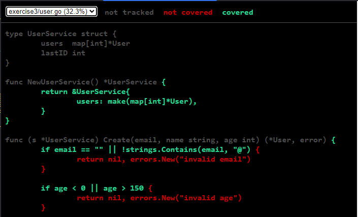

 %% Required for proper codeblock width %%
<style>
li,p {
	font-size: 28px;
}

pre > code {
    font-size: 16px;
    line-height: normal;
}

code {
	font-size: 24px;
	font-style: italic;
	background-color: #3f3f3f;
	padding: 0;
}

/* left-align all content in Slides */
.slide-title {
    background-color: #343434 ;
    border: 1px solid coral;
}

section > div > h3 {
	position: absolute !important;
	top: 0 !important;
	margin-left: auto !important;
	margin-right: auto !important;
	left: 0 !important;
	right: 0 !important;
	text-align: left !important;
}

section > div > h4 {
	position: absolute !important;
	top: 80px !important;
	margin-left: auto !important;
	margin-right: auto !important;
	left: 0 !important;
	right: 0 !important;
	text-align: left !important;

	font-size: 32px !important;
}

section > div {
	align-items: left !important;
	justify-content: center !important;
	text-align: left !important;
}

/* If it is a title slide */
section > div:has(h1) {
	align-items: center !important;
	justify-content: center !important;
	text-align: center !important;
}
</style>

%% Start of slides %%

%% <!-- .element: class="slide-title" --> %%
# Devbook 

## Meeting 5 

---
### Plan

- Testing
- Benchmarking
- Go linters

---


# Testing

--

### Fundamentals

- Go has a built-in testing framework `go test`.
- Test files must end with `_test.go`
- Test functions must start with `Test*` and have the same signature 

```go
func TestSomething(t *testing.T) {}
```

--
### go test

```
go test -v            // runs tests in verbose mode
go test ./...         // runs all tests in the current directory and all subdirectories
go test ./module/...  // runs all tests in `module` and its subdirectories
go test -run Add      // runs all tests that contain the string `Add` in their name
go test -count=1      // disable test caching
```

--

### testing.T

- [Documentation](https://pkg.go.dev/testing)
- Provides a number of methods for managing tests

```go
func TestUserValidation(t *testing.T) {
    user := User{ Email: "invalid-email", Age: 15}

    err := user.Validate()
    if err == nil {
        t.Error("expected validation error for invalid email")
    }

    if !strings.Contains(err.Error(), "email") {
        t.Errorf("expected error about email, got: %v", err)
    }
}
```

--

### testing.T - logs

`t.Log` - prints a message<br>
`t.Error` - prints an error message and fails the test<br>
`t.Fatal` - prints an error message and stops the test run<br>

Functions also have a ***f** variant that accepts format strings and arguments

```go
func TestAdd(t *testing.T) {
    t.Log("Add(1, 2) =", Add(1, 2))
    t.Error("Error message")
    t.Fatal("Fatal message")
    t.Logf("Will not be printed: %d", 1)
}
=== RUN   TestAdd
    struct_test.go:33: Add(1, 2) = 3
    struct_test.go:34: Error message
    struct_test.go:35: Fatal message
--- FAIL: TestAdd (0.00s)
```

--

### testing.T - flow control

`t.Run` - runs a subtest<br>
`t.Skip` - logs a message and then stops the test run<br>
`t.SkipNow` - same, without a message<br>
`t.Fail` - fails the test<br>
`t.FailNow` - fails the test and stops the test run

```go
func TestAdd(t *testing.T) {
    t.Run("ok", func(t *testing.T) { 
	    t.Log("ok") 
	}
    t.Run("skip", func(t *testing.T) { 
	    t.Skip("skipped") 
	}
}
=== RUN   TestAdd
=== RUN   TestAdd/ok
    struct_test.go:34: ok
--- PASS: TestAdd/ok (0.00s)
=== RUN   TestAdd/skip
    struct_test.go:37: skipped
--- SKIP: TestAdd/skip (0.00s)
```

--

### Good practices

- Keep tests close to tested code
- Keep the same naming scheme. For example:
	- `Test{Function}` for functions
	- `Test{Struct}_{Method}` for methods
- Use subtests instead of new test functions for cases
- Follow the AAA pattern:
	-  Arrange (setup)
	- Act (execute)
	- Assert (verify)

--

### Exercise 1: Calculator

In **exercise1** you will find a calculator structure with **Add** function.

Add following functions:

```go
func Sub(a, b float64) float64 // subtracts b from a
func Div(a, b float64) (float64, error) // divides a by b
```

Steps:

1. Implement the functions
2. Write tests for both methods
3.  Run tests to verify implementation
4. Refactor if needed

--

### Table-Driven Tests


```go
func TestAbs(t *testing.T) {
    tests := []struct {
        name     string
        input    int
        want     int
    }{
        {
            name:    "positive",
            input:   1, want:    1,
        }, {
            name:    "zero",
            input:   0, want:    0,
        }, {
            name:    "negative",
            input:   -1, want:    1,
        },
    }
    for _, tt := range tests {
        t.Run(tt.name, func(t *testing.T) {
            got := Abs(tt.input)
            if got != tt.want {
                t.Errorf("Abs(%d) = %d, want %d", tt.input, got, tt.want)
            }
        })
    }
}
```
<!-- .element: style="height:72%" -->

--

### Table-Driven Tests

- Test multiple scenarios efficiently
- Consistent test structure
- Easy to add new test cases
- Clear overview of test coverage
 
--

### Table-Driven Tests

Good for:
- String formatting functions
- Validation rules
- Calculation functions
- Parsing functions
- API endpoint responses

Bad for:
- Complex setup / teardown requirements
- Different verification methods
- Stateful tests

--

### Structured Tests

Benefits:
- Organize related tests
- Run specific subtests
- Better test output
- Parallel execution support

```go
func TestUserService_Create(t *testing.T) {
    // Common setup
    service := NewUserService()

    // Grouped tests
    t.Run("ok", func(t *testing.T) {
        t.Run("ok_1", func(t *testing.T) {})

        t.Run("ok_2", func(t *testing.T) {})
    })

    t.Run("error", func(t *testing.T) {
        t.Run("no_email", func(t *testing.T) {})

        t.Run("too_young", func(t *testing.T) {})
    })
}
```

--

### Setup/Teardown

```go
func TestDatabase(t *testing.T) {
    // Common setup
    db := setupTestDB(t)
    t.Cleanup(func() { db.Close() })

    t.Run("insert", func(t *testing.T) {
        // Test-specific setup
        user := createTestUser(t)

        // Test logic
        err := db.Insert(user)
        if err != nil {
            t.Errorf("failed to insert: %v", err)
        }
    })
}
```

--

### Choosing Test Structure

Table-Driven Tests:
- Simple, repetitive test cases
- Same setup for all cases
- Testing different inputs/outputs

<br>

Structured Tests:
- Complex setup/teardown
- Different setup per test
- Testing different behaviors

--

### Helper Functions

```go
func assertUserValid(t *testing.T, user User) {
    t.Helper() // Marks the function as a helper function
    if user.Email == "" {
        t.Error("email is empty")
    }
    if user.Age < 18 {
        t.Error("user is too young")
    }
}

func TestUser_Get(t *testing.T) {
    srv := NewUserService()
    user := srv.Get(1)
    assertUserValid(t, user)
}

func TestUser_Get(t *testing.T) {
    users := srv.List()
    for _, user := range users {
        assertUserValid(t, user)
    }
}
```

- Improve test readability
- Consistent error reporting
- Reusable test utilities

--

### Exercise 2: Email Validator

In `exercise2` you will find an implementation of email validator.

Write tests for this function and fix any mistakes you encounter.

---

# Coverage

--

### Code coverage

- We can check coverage using built-in Go tools 

```
go test -cover                     // run tests and show coverage
go test -coverprofile=coverage.out // save coverage to a file
go tool cover -func=coverage.out   // show coverage summary
go tool cover -html=coverage.out -o coverage.html // show coverage in a browser
```

--

### Html View




- Green: Covered lines
- Red: Uncovered lines
- Gray: Non-executable lines

--


### Coverage Best Practices

1. Don't aim for 100%
	- Diminishing returns
	- Some code isn't worth testing
	- Focus on critical paths

2. Coverage Targets
   - Business logic: 70-90%
   - Data models: 60-70%
   - Generated code: 0%

3. Quality over Quantity
   - Meaningful assertions
   - Edge cases
   - Error conditions


--

### Exercise 3: Coverage Analysis

1. Run the coverage analysis:
   ```bash
    go test -coverprofile=coverage.out ./...
    go tool cover -func=coverage.out
    go tool cover -html=coverage.out
   ```

2. Identify untested code paths:
   - Which methods need more test coverage?
   - What edge cases are missing?
   - Are there error conditions not being tested?

1. Improve the test coverage (homework):
   - Add tests for Update and Delete methods
   - Add tests for error conditions
   - Test edge cases (empty values, invalid inputs)
   - Use table-driven tests where appropriate

---

# Benchmarking

--

### Benchmarking in Go

Similar to testing go provides tools for benchmarking your code.
- `go test -bench .` - runs benchmarks
- `go test -benchmem` - runs benchmarks and shows memory usage
- `go test -benchtime 10s` - runs benchmarks for 10 seconds

Benchmark functions must start with `Benchmark` and receive `*testing.B`

```go
func BenchmarkFunction(b *testing.B) {}
func BenchmarkStruct_Method(b *testing.B) {}
```

--
### testing.B

- [Documentation](https://pkg.go.dev/testing)
- Provides a number of methods for managing benchmarks.
- We have access to the same functions for logs and structured benchmarking as in `testing.T`

```go
func BenchmarkRandInt(b *testing.B) {
    expensiveSetup()

    for b.Loop() {
        benchmarkedLogic()
    }
}
```

--
### Benchmark report

```go
func BenchmarkRandInt(b *testing.B) {
    for b.Loop() {
        rand.Int()
    }
}
```

```
go test -v -bench .

goos: linux
goarch: amd64
pkg: benchmarking
cpu: 12th Gen Intel(R) Core(TM) i7-12700
BenchmarkRandInt
BenchmarkRandInt-20     198654988                6.034 ns/op
PASS
ok      benchmarking    1.201s
```

Loop ran 198 654 988 times at a speed of 6.034 ns per loop.

--
### Exercise 4: Efficient Adder

1. Check implementation of `Add` function
2. Implement `AddBetter` with a better implementation
3. Write benchmarks for each of them and compare results

---

# Code quality

## golangci-lint

--

### Linters

Standard go toolset provides some linters already:
- `go fmt` - enforces canonical formatting
- `go vet` - checks for suspicious construct, likely bugs, correctness

[Golangci-lint](https://golangci-lint.run/docs/) is an external, highly configurable tool for maintaining code quality
- controlled by `.golangci-lint.yml` 

Note:
go vet checks for example for:
- incorrect `Printf`/`Sprintf` format arguments
- unreachable or suspicious code patterns
- copylocks and nilness-related warnings in some cases
- misuse of `struct` tags and other common mistakes

--

### golangci-lint

Common linters:

```
linters:  
  enable:  
    - govet  
    - staticcheck  # A lot of checks with automatic fixes
    - errcheck     # Ensures returned errors are handled 
    - ineffassign  # Detects ineffective assignments
    - unused       # Warns about unused code
    - revive       # Style and quality checks
    - gocritic     # Provides sugestions to simplify code
    - gofmt        # Ensures standard formatting
    - goimports    # Checks if imports are sorted 
	- gosec        # Inpsects for known security issues
# and many more
```


--
### Exercise 5: Code quality

1. Run `golangci-lint run` in exercise 5 folder.
2. Check the issues.


---

### More information

[Common Go Mistakes](https://100go.co/#not-understanding-race-problems-data-races-vs-race-conditions-and-the-go-memory-model-58)

[Learn Go with tests](https://github.com/quii/learn-go-with-tests)

[testify - documentation](https://github.com/stretchr/testify)

[Golang - synctest post](https://go.dev/blog/synctest)

[Vincent Demeester - Golang testing - golden file](https://vincent.demeester.fr/posts/2017-04-22-golang-testing-golden-file/)